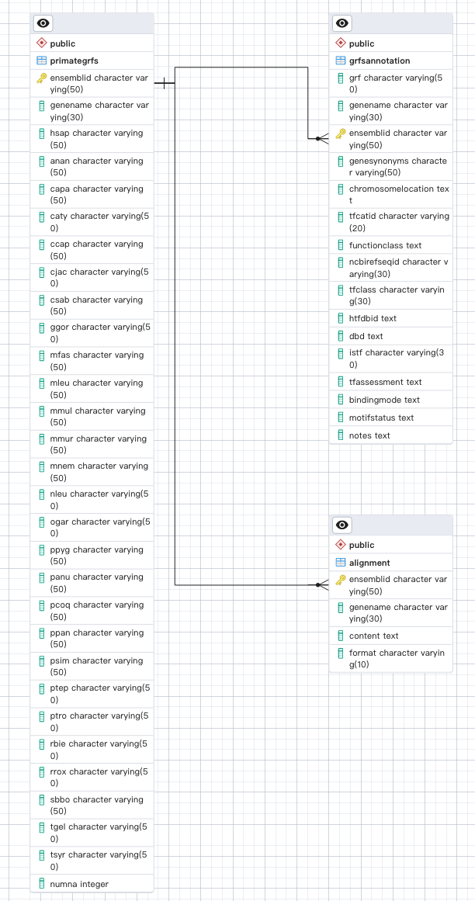

# grfprimate_db
MySQL database for grfprimate website

## create a docker image for mysql
```shell
# 1. pull the latest mysql
docker pull mysql

# 2. Run a mysql container
docker run -d --name mysql-container -e MYSQL_ROOT_PASSWORD=your_password -e MYSQL_DATABASE=grfprimate -p 3306:3306 mysql:latest

# 3. verify the MySQL container
docker ps

#4. stop or remove container
docker stop mysql-container
docker rm mysql-container
```

## access mysql-container and grfprimate database 
```shell
docker exec -it mysql-container bash #access the mysql container
mysql -u root -p grfprimate #access the grfprimate database
```

## You will need to first create tables in the database and load data into it
```shell
python create_mysql_table.py
python insert_grfs.py
```


## restore `tfprimate.sql` to `tfprimate` table, this will be update to mysql
```shell
# restore
psql -U postgres -W -d tfprimate -f tfprimate.sql

# login
psql -U postgres -d tfprimate
```


# Table Schema ERD
